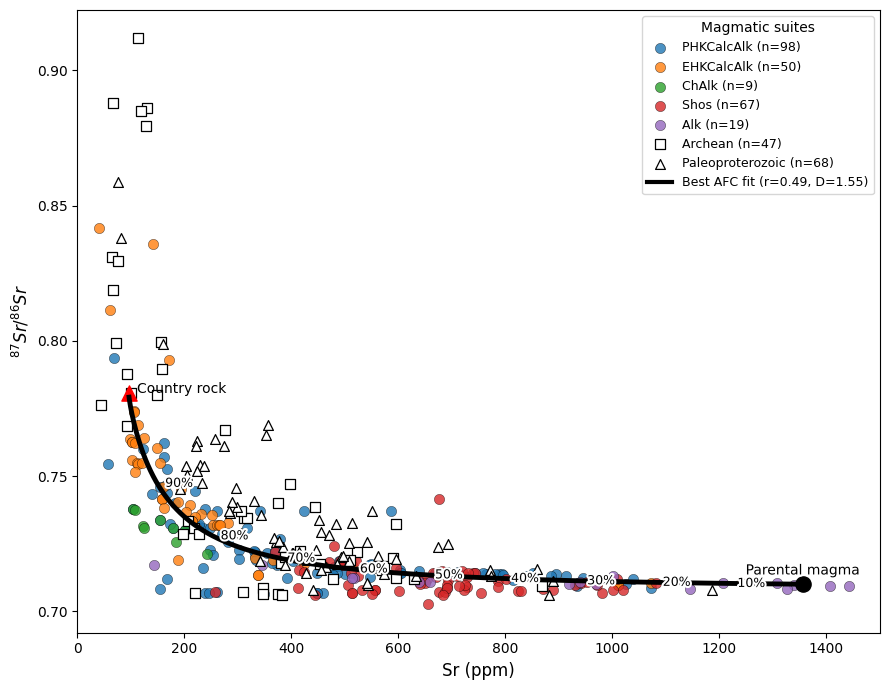

# Borborema Magmatism Toolkit

[]()
[]()

Python toolkit for geochemical, isotopic, and geochronological analysis of magmatic systems, developed for the study of Ediacaran–Cambrian granitoid magmatism in the Borborema Province (NE Brazil).

This toolkit was developed to support integrated studies of:

- whole-rock geochemistry
- radiogenic isotopes
- zircon U–Pb geochronology

in post-collisional granitoid systems.

---

# Overview

The toolkit integrates analytical workflows commonly used in igneous petrology and isotope geochemistry.

Applications include studies of the magmatic evolution of the **Rio Grande do Norte Domain** in the Borborema Province.

Implemented workflows include:

- whole-rock PCA
- AFC modelling
- Sm–Nd isotopic panels
- zircon U–Pb age plots

---

# Requirements

Python 3.9+

Required packages:

```text
numpy
pandas
matplotlib
scikit-learn
scipy

Install all dependencies with:

pip install -r requirements.txt

# Repository structure

borborema-magmatism-toolkit/

├── README.md
├── requirements.txt
├── run_all_figures.py
│
├── sample_data/
│   ├── wr_pca_exemple.csv
│   ├── afc_model_exemple.csv
│   ├── sr_nd_models_exemple.csv
│   └── upb_geochronology_exemple.csv
│
├── figures/
│   ├── pca_plot.png
│   ├── afc_model.png
│   ├── sm_nd_panel.png
│   └── upb_ages.png
│
└── borborema/
    ├── __init__.py
    ├── wr_pca.py
    ├── afc_model.py
    ├── sr_nd_models.py
    ├── upb_geochronology.py
    ├── datasets.py
    └── data_cleaning.py

---

# Installation

Clone the repository:

```
git clone https://github.com/cataclase/borborema-magmatism-toolkit
cd borborema-magmatism-toolkit
```

Install dependencies:

```
pip install -r requirements.txt
```

---

# Whole-rock geochemistry – PCA

Principal Component Analysis allows identification of geochemical trends and clustering of magmatic suites.


Example:

import pandas as pd
from borborema.wr_pca import run_pca_from_dataframe

df = pd.read_csv("sample_data/wr_pca_exemple.csv", encoding="utf-8-sig")
df.columns = df.columns.str.replace("", "", regex=False)

variables = [
    "SiO2", "MgO", "CaO", "Na2O", "K2O",
    "Rb", "Ba", "Sr", "Nb", "Zr", "Y", "Th", "La", "Ce"
]

fig, results = run_pca_from_dataframe(
    df,
    variables=variables,
    series_col="Suite"
)

print("Explained variance:", results["explained_variance"])
print("Groups:", results["groups"])
from borborema.wr_pca import run_pca
```

---

# Rb–Sr isotope modelling – AFC

Assimilation–Fractional Crystallization modelling following DePaolo (1981).



Example:

import pandas as pd
from borborema.afc_model import run_afc_from_dataframe

df = pd.read_csv("sample_data/afc_model_exemple.csv", encoding="latin1")

fig, results = run_afc_from_dataframe(
    df,
    Sr_m=1356,
    R_m=0.71008,
    Sr_c=96.8,
    R_c=0.7808,
    series_col="SERIE",
    iterations=10000,
    random_state=42
)

print("Best r:", results["best_r"])
print("Best D:", results["best_D"])
from borborema.afc_model import monte_carlo_afc
```

---

# Sm–Nd isotopic evolution

Visualization of εNd(t) versus age with comparison to the depleted mantle evolution curve.


Example:

import pandas as pd
from borborema.sr_nd_models import run_sr_nd_from_dataframe

df = pd.read_csv("sample_data/sr_nd_models_exemple.csv", encoding="latin1")

fig, results = run_sr_nd_from_dataframe(df)

print(results)
from borborema.sr_nd_models import plot_eNd_age
```

---

# U–Pb geochronology

Visualization of zircon crystallization ages and associated analytical uncertainties.


Example:

import pandas as pd
from borborema.upb_geochronology import plot_upb_ages

df = pd.read_csv("sample_data/upb_geochronology_exemple.csv", encoding="utf-8-sig")

fig = plot_upb_ages(df)
from borborema.upb_geochronology import plot_upb_ages
```

---

# Reproducing all figures

All figures used in the examples can be generated automatically:

```
python -m borborema.run_all_figures
```

Figures will be saved in:

```
figures/
```

---

# Scientific context

The toolkit was developed to investigate:

• Post-collisional magmatism
• Crust–mantle interaction
• Magmatic differentiation processes
• Isotopic evolution of granitoid systems

The workflows implemented here were applied to magmatic suites of the Borborema Province.

---

# Code availability

All scripts used for geochemical modelling and figure generation are available in this repository.

---

# Author

Caio Tavares
Mine Geologist | Igneous Petrology | Isotope Geochemistry

---

# License

MIT License


